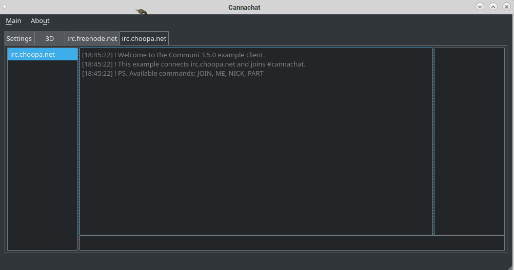

# cannachat
qt based irc client using libircclient

irrlicht only version here
https://github.com/tecan/IrrlichtDemos/tree/master/Apps/Irrlicht-IRC

Irrlicht SVN can be buggy with QT  so use 1.8.4

builds for windows and linux has working ssl support

need to impliment server loading and saving- gui only for now.
